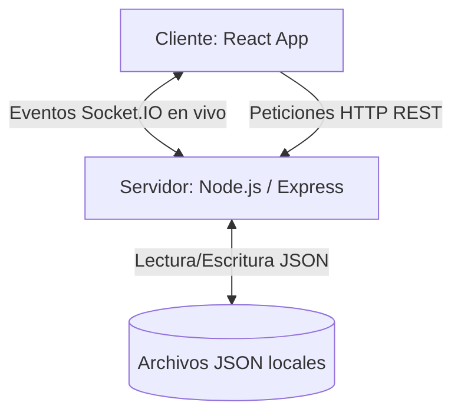

# Pasapalabra 🎡

Un juego interactivo multijugador en tiempo real basado en el popular programa de televisión **Pasapalabra** (El Rosco), desarrollado con **React + Vite** para el cliente y **Node.js + Express + Socket.IO** para el servidor.

---

## 🚀 Cómo Clonar y Levantar el Proyecto

Sigue estos sencillos pasos para tener el proyecto corriendo localmente en tu computadora:

### 1. Clonar el Repositorio
Abre tu terminal y ejecuta el siguiente comando:
```bash
git clone https://github.com/Darkops56/Pasapalabra.git
cd Pasapalabra
```

### 2. Levantar el Frontend (Cliente)
Desde la raíz del proyecto, ejecuta:
```bash
# Instalar dependencias del cliente
npm install

# Iniciar el servidor de desarrollo de Vite
npm run dev
```
*Por defecto, el cliente se levantará en el puerto `5173` (o `5174` si está ocupado), disponible en `http://localhost:5173`.*

### 3. Levantar el Backend (Servidor)
Abre otra pestaña o ventana de la terminal, navega a la carpeta del servidor y ejecuta:
```bash
# Ir al directorio del servidor
cd server

# Instalar dependencias del backend
npm install

# Iniciar el servidor
npm run dev
```
*El servidor de Node.js se levantará en el puerto `3001`.*

---

## ⚙️ Funcionamiento del Sistema

El juego está diseñado con una arquitectura cliente-servidor híbrida que combina peticiones HTTP (API REST) y comunicación bidireccional en tiempo real (WebSockets).



### 🔄 Flujos Principales:
1. **Páginas de Inicio e Información**:
   - El cliente consulta `/api/ruletas` para cargar las ruletas creadas por los usuarios, y `/api/ruletas/default-ranking` para obtener los rankings de las ruletas por defecto (`defaultRuleta.js`).
2. **Creación de Ruletas**:
   - Los usuarios crean ruletas personalizadas mediante la interfaz del creador. Estas se envían al backend (`/api/ruletas/new`), guardando la definición en `ruletasData.json` y su contraseña en `ruletasPasswords.json`.
3. **Flujo de Juego Multijugador (Tiempo Real)**:
   - **Host (Presentador)**: Ingresa a `/dashboard/:id` validando la contraseña de la ruleta mediante `/api/verify-host`. Se conecta al servidor vía Socket.IO y se une a la sala de moderador (`host-ruletaId`).
   - **Jugadores**: Ingresan al juego desde `/jugar/:id`. Al conectarse a Socket.IO, se validan los nombres de usuario para evitar colisiones y se unen a la sala de juego. Los eventos como unirse (`player:join`), progreso de juego (`player:update`), cambio de estado (`player:status`) o finalización (`player:finished`) se transmiten instantáneamente al Host.
4. **Ranking y Persistencia**:
   - Al finalizar el juego, los resultados se envían a `/api/ruletas/:id/ranking`. Si es una ruleta por defecto, se almacena en `defaultRanking.json`; si es una ruleta personalizada, se guarda dentro de la estructura de la ruleta en `ruletasData.json`.

---

## 📁 Estructura del Proyecto

A continuación se detalla la estructura principal del espacio de trabajo:

```text
Pasapalabra/
├── server/                     # Directorio del Backend (Node.js)
│   ├── index.js                # Lógica del servidor (Express, Sockets, Rutas)
│   ├── ruletasData.json        # Base de datos de ruletas creadas por usuarios
│   ├── ruletasPasswords.json   # Contraseñas de las ruletas (host dashboard)
│   ├── defaultRanking.json     # Historial de rankings para ruletas estáticas
│   ├── package.json            # Scripts y dependencias del backend
│   └── README.md               # Documentación específica del backend
│
├── src/                        # Directorio del Frontend (React)
│   ├── components/             # Componentes modulares de interfaz (RuletaCard, etc.)
│   ├── data/                   # Datos estáticos (defaultRuleta.js)
│   ├── hooks/                  # Custom Hooks de React (useRuletas.js para la API)
│   ├── views/                  # Vistas principales de la aplicación:
│   │   ├── Home.jsx            # Selector de ruletas y Rankings
│   │   ├── Creator.jsx         # Creador interactivo de ruletas
│   │   ├── Game.jsx            # Interfaz de juego para los participantes
│   │   └── HostDashboard.jsx   # Panel de control en vivo para el presentador
│   │
│   ├── App.jsx                 # Configuración de Rutas principales (react-router-dom)
│   ├── main.jsx                # Punto de entrada de renderizado de React
│   └── index.css               # Estilos globales y tokens CSS
│
├── tailwind.config.js          # Configuración de Tailwind CSS
├── vite.config.js              # Configuración del empaquetador Vite
└── README.md                   # Esta guía general
```
